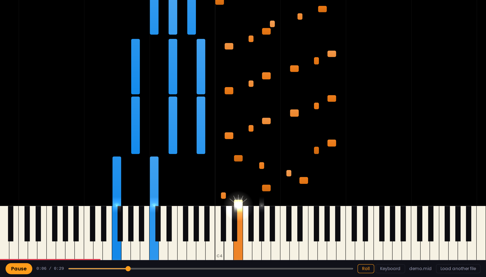
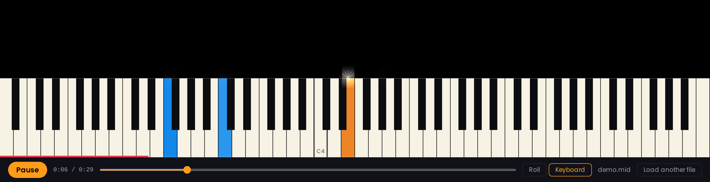
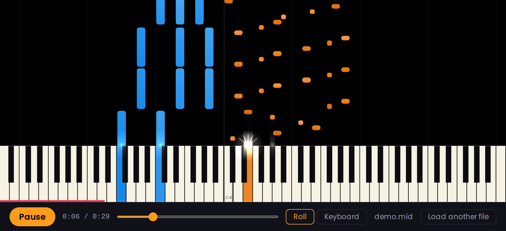
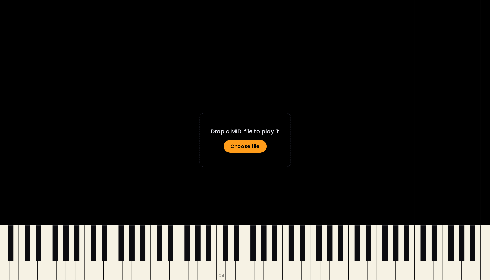
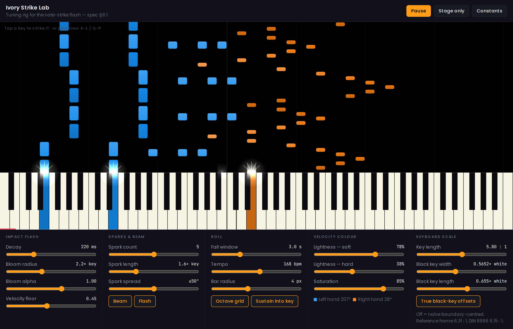

# Tickle Me Ivorys

A browser piano visualiser. Load a MIDI file and watch it play on a full 88-key
keyboard with a falling piano roll and a white note-strike flash — the
SheetMusicBoss / Synthesia treatment, drawn to real piano proportions.



**Status:** the core playback engine is built and merged. The settings layer,
notation view and live MIDI input are scoped and not yet started — see
[Scoped for v2](#scoped-for-v2).

## Quick start

```bash
npm install
npm run dev -- --host 0.0.0.0
```

The `--host` flag matters: it binds `0.0.0.0` so you can open the printed
**Network** URL on a phone and check the landscape layout on real hardware.

Then drop a `.mid` file onto the page.

## What it does today

- **Full 88-key keyboard at true piano scale.** Black keys use the equal-tails
  construction real pianos are built with — offsets of `-b/6`, `+b/6`, `-b/4`,
  `0`, `+b/4` from the white-key boundary, where `b` is the black-key width.
  G# is the only black key that actually sits on a boundary. Key length derives
  from key *width*, never the viewport, so proportions hold at every size.
- **Falling piano roll.** Coloured bars fall onto the keys and keep drawing down
  over a key while its note is held, so the bar and the lit key read as one
  object. Windowed by binary search: a 20,000-note file costs the same per frame
  as a 200-note one.
- **Note-strike flash.** A bloom, a white-hot beam and five sparks at the moment
  a note lands, decaying over 220 ms and scaled by velocity. It is a pure
  function of time, so scrubbing backwards produces exactly the right flash with
  no particle pool to reset.
- **Velocity colour.** Each voice owns a hue; velocity drives lightness within
  it — soft notes light, hard notes dark.
- **MIDI loading with hand detection.** Multi-track files become one voice per
  track; a single-track file splits into left and right hands at middle C.
  Conductor tracks (tempo/meta, no notes) are correctly ignored.
- **Sampled piano audio** via [smplr](https://github.com/danigb/smplr), scheduled
  ahead of time so it stays sample-accurate under load.
- **Two display modes** — falling roll, or keyboard highlight only.
- **Transport** — play/pause, scrub, and a keyboard that lights in time.
- **Middle C marker** so orientation survives phone-width keys.

## Screenshots

**Falling roll** — the default mode, above. Left hand blue, right hand orange;
velocity drives lightness within each hue. Bars keep drawing down over a key
while its note is held, and each strike throws a bloom, a beam and five sparks.

**Keyboard only** — same clock, no roll. Keys light and flash in time.



**Phone landscape** — 88 keys at ~16 px per white key, with middle C's dark
border and `C4` label carrying orientation.



**Empty state** — the keyboard is drawn before anything is loaded.



**Tuning rig** (`tools/strike-lab.html`) — every visual constant as a live
control, with a Constants button that exports the tuned values as JSON. No build
step, no dependencies.



## How it works

`AudioContext.currentTime` is the single clock. A 25 ms interval asks a
cursor-based scheduler for every note due within the next 150 ms and hands them
to the sampler with exact start times; a separate `requestAnimationFrame` loop
reads the same clock and redraws.

**Everything visible is a pure function of `t`** — no stored frame state, no
accumulation. That is what makes seeking, pausing and tempo changes correct by
construction rather than by cleanup.

Musical time (ticks) is the truth in the data model; seconds are always derived
through a tempo map, so tempo can change repeatedly without the score degrading.

## Scoped for v2

Three tranches, each shipping working software on its own.

### Settings, voices and profiles

- [ ] Master BPM control — tempo scale (25–300%, respecting the file's tempo map)
      and absolute-BPM override, toggleable
- [ ] Per-voice colour assignment, renaming, show/hide and mute
- [ ] Per-voice instrument selection (the audio engine already accepts this — it
      needs UI, not plumbing)
- [ ] Per-voice volume — **must not** be built on the current velocity fold; see
      the handover note on sample layers
- [ ] Velocity colour schemes — single-hue lightness ramp and multi-stop gradient
- [ ] Keyboard zoom: auto-fit to a piece's pitch range, widened so it never cuts
      through the middle of a black-key group
- [ ] Display settings — fall speed, octave grid, flash intensity, note names
- [ ] Profile JSON — autosave per file by content hash, plus export/import
- [ ] Metronome driven by the tempo map
- [ ] Admin/debug route carrying the tuning rig in `tools/strike-lab.html`

### MusicXML and notation

- [ ] `.xml`, `.musicxml` and `.mxl` loading, with ties merged and parts/staves
      becoming voices
- [ ] Verovio notation mode with a playback cursor on the shared clock
      (MusicXML only — Verovio cannot import MIDI)

### Live MIDI input

- [ ] Web MIDI input lighting keys by velocity (Chromium only — no Firefox or
      Safari support for Web MIDI)
- [ ] Local sound on input, so a silent controller becomes a piano
- [ ] Device selection and hot-plug handling

## Later

Designed for, deliberately not scoped yet: MIDI-to-notation transcription
(quantise, spell, hand-split, beam), practice/wait mode with hit scoring, loop
regions, rising trails for live input, and recording or video export.

## Development

```bash
npm test                      # 94 tests
npm run build                 # tsc -b && vite build
node tests/geometry-check.mjs # independent geometry oracle

node scripts/make-demo-midi.mjs  # regenerate docs/demo.mid
node scripts/screenshots.mjs     # regenerate every screenshot in this README
```

`docs/demo.mid` is a generated two-track fixture — a left hand of bass octaves
and chords, a right hand of 16th-note arpeggios — used for the screenshots and
handy for manual testing.

Use `npm run build` rather than `npx tsc --noEmit` — the latter reads the root
tsconfig and skips `tsconfig.app.json`, which is where `strict` and
`erasableSyntaxOnly` live. A build breakage once hid behind exactly that gap.

`tools/strike-lab.html` is a standalone tuning rig: open it directly in a browser
to adjust every visual constant live — flash decay, bloom radius, spark count,
velocity colour range, and the keyboard scale constants — and export the tuned
values as JSON. It has no build step and no dependencies. If the rig and the
spec ever disagree, the rig is right.

## Documentation

| Document | What it is |
|---|---|
| [`docs/superpowers/specs/`](docs/superpowers/specs/) | The design spec: architecture, data model, geometry, colour system |
| [`docs/superpowers/plans/`](docs/superpowers/plans/) | The implementation plan this was built from |
| [`docs/superpowers/handover/`](docs/superpowers/handover/) | Decisions taken during the build, constraints carried forward, findings deliberately left unfixed |

## Credits

Keyboard geometry is shared with [`@pepperhorn/chordl-core`](https://github.com/pepperhorn/chordl),
which uses the same equal-tails construction.
